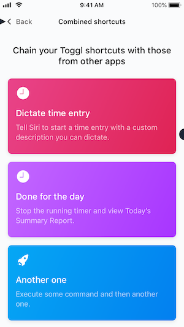

## Update workflows

### Intro

The screen is located in Settings > Workflows in the iOS App



The content of this screen is loaded dynamically from a JSON file hosted on Firebase:

- https://toggl-mobile.firebaseapp.com/workflows.json
- https://toggl-mobile.firebaseapp.com/dev/workflows.json (used for development builds)

The JSON payload contains an array of "shortcut" as follow:

```json
[
  {
    "title": "Dictate time entry",
    "description": "Tell Siri to start a time entry with a custom description you can dictate.",
    "fileName": "dictate.shortcut",
    "color": "#06AAF5",
    "icon": "icMic"
  }
]
```

Most of the fields are self descriptive, except:

- `fileName` is the relative path used to construct the download URL. For instance: `https://toggl-mobile.firebaseapp.com/dev/dictate.shortcut`
- `icon` is the asset name preloaded in the app.
- `color` the color of the card in hex format start with `#`, for instance `#06AAF5`

### How to update?

The files are put under version control in the [../../public](../../public) folder.

- Install [Firebase CLI](https://firebase.google.com/docs/cli)
- Open a shell at root of this repo
- Execute `firebase deploy`
